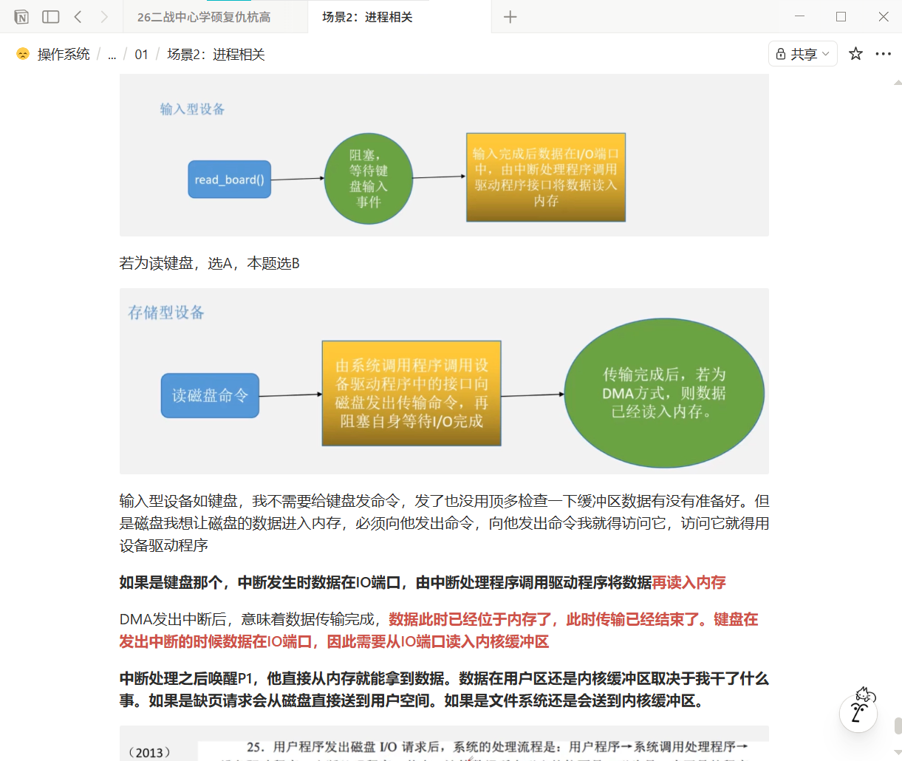
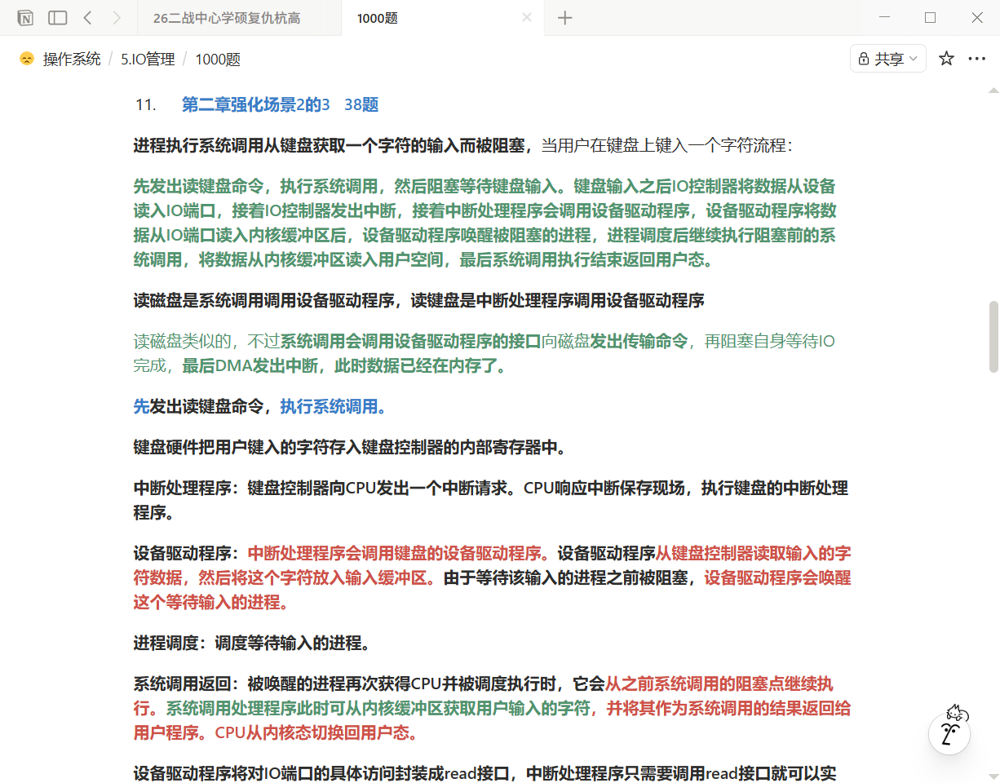

# 二战中心学硕复仇杭高

> 双非二战，26 考研上岸网络中心学硕（杭高代招）
> 总分 347：政治 50 · 英一 61 · 数一 121 · 408 115
> 作者：匿名学长 · 2026-08

## 一、基本情况

本科某双非人工智能专业，但本科只学过数据结构和计网，专业排名 11/89。本科期间两次校级奖学金，竞赛只有很水的数模竞赛和数学竞赛。无论文、无科研，项目都是初试结束后做的：一个大模型、一个 agent、一个图像方向的毕设。

关于简历建议：好好打磨、好好包装，弄清楚简历上项目所写的每一个名词。

一战杭高 326 分，被 350 的复试线碾压，杭高成了遥不可及的白月光。一战结束后，我们「杭高难民」建了个小群，大伙偶尔水水群、问问题。猫咪一直给群里大伙提供择校信息，也很感谢猫咪给我推荐的网络中心杭高代招，终于圆梦国科大。

## 二、关于杭高代招与复试

关于杭高的情况就不多说了。中心这边从 25 年开始有杭高代招，25 年中心第一批复试完之后临时增加杭高复活赛。26 年虽然研招网上没有写杭高代招，但根据一系列推测，最后应该还是会有杭高代招。果然在选导师的时候，链接里可以直接一志愿选杭高代招（仅限学硕报考；25 年复活赛有专硕调剂杭高学硕是个例外），这也就意味着像 25 年一样的复活赛没有了（截至 2026.3.31 无复活或补录）。

今年中心变化很大，以前基本都是 1.2~1.3 的复录比，保护高分，非常友好，但是今年学硕 14/21、1.5 的复录比，专硕 18/29、1.6 的复录比。如果后面几天还没有复活赛或者补录之类的，那么这个复录比请谨慎报考。

中心这边是先选导师再复试，也就是说你的竞争对手就是和你报同一个导师的人。所以选导的时候请多了解导师信息（研究方向等）以及竞争对手信息（挑比自己弱的、分数低的，或者觉得自己有绝活能翻盘）。今年学硕杭高有一个 370 似乎被 330 翻盘了，不清楚原因。

中心对于双非我认为是不存在歧视的，至少你要保证你的分数排名能在有效名额之内，此外方向与导师尽可能要对口。复试包括笔试和面试，笔试不算分，考察面很广，答不出来非常正常，仅作为老师的参考。

今年名额迟迟不定，复试前一天才给导师名单，我们只有 5 个小时博弈。我的目标本来是科技云或者大数据部，这两个部门都是大部门、往年导师都很多，但是今年科技云只给了一个老师，和我方向相关的被高分同学选了，最后我报了前瞻的老师。直到拟录取出来我都一直很焦虑，担心方向不对口会被刷掉，还好有惊无险。一点点建议：复试前了解一下导师的研究方向，复试时也许会有压力面，但一定要保持从容谦虚的态度，好好表现自己。

## 三、初试备考

（番茄钟：一战从 24.6–24.12 统计 6 个月；二战 25.4–25.12）

### 政治

49 → 50，没话说，天生没有文科的头脑，去年 49、今年 50，喜提 1 分。

### 英语

去年英二京区 55，今年英一 61。我是日语高考生，高二转的日语；大一报了四级没去，被禁赛一年，大二开学裸考了一次，425 抄底成功，之后一直考六级一直没过。

我英语感觉只有词汇量。扇贝 5500 在一战 7 月份就已经非常熟了，10 分钟差不多能过 260 多个。词汇建议早早开始，前期大量填鸭背诵，比如去图书馆路上背一背，中后期词汇压力会小很多。二战期间我报了一个胡八一老师的班（B 站），几乎是从语法方面开始学，花费了一定的时间，但从分数提升上来说挺满意的，而且价格不贵，我记得好像才 200 左右。如果你英语基础好，我觉得没必要花时间；但这个老师后期提供的一些英语压轴篇训练我觉得很好，而且老师也都会录视频讲解，很适合真题刷完了不知道刷什么的时候去做。

### 数学

去年数二 126，今年数一 121，只能说稳住了数学成绩，变化不大。数二与数一的差距我觉得还是蛮大的，数一高数部分几乎都集中在数一独有部分。我从二战 5 月开始到 9 月，感觉数一一直都在打基础，线面积分那些经常忘，概率论学得也挺痛苦，好在都坚持下来了。

一战数二强烈建议 880，吃透一本足够了，前期可以拿 660 高数打打基础，重点放在 880 上。二战我因为刷过了 880，就选择了 1000 题，应该是只做了数一独有部分的基础和强化 + 数二部分的强化。1000 题刷完一遍订正之后就几乎没回顾过了，很多题我感觉没什么意思就懒得回顾。因为一战基础还可以，我就直接开刷超越了，也建议数学基础好的可以多刷刷超越，早年的也可以刷。数学就多保持思维、保持做题手感。

### 408

一战 96，二战 115，提高近 20 分，而且今年 408 是真的变态，我考完都快走马灯了，已经做好继续两位数的准备，没想到出分还很意外。我是报了零壹（01）的班，虽然有去年的基础，但我还是全程跟了一下零壹的基础强化班。零壹的课挺让我意外的，每年的基础和强化课都是直播课，每年都在打磨课程，他们基础阶段有很多细节点是王道课没有的（王道基础课似乎好几年没变了，感觉有点跟不上 408 的变化了）。

今年的 408 计组有道大题真的让零壹压中了，学习过程中那部分我搞清楚了，可惜考前我觉得应该考不到，最后考场上那道题很多都没写出来，很可惜（时间允许的情况下，不要放过任何一个考点，不要给自己埋雷）。假如稍微复习一下，感觉能再有个 5~6 分的提升。

此外建议 408 多做笔记，尤其是零壹的网课，很多重点用 PPT、Notion 之类的记录一下，一些很经典的工作流程也可以记录下来多回顾。比如磁盘 IO 和键盘 IO 的区别，两个具体完整的工作流程能否详细说出来？把所有模糊的点搞清楚，做做笔记，用 XMind 做做思维导图，对后期的复习很有利，效率很高。

在这里强烈推荐一下零壹。二战难民小群也有一位报了零壹，今年 114，这几千块的提高我觉得很值。零壹只要是 408 范围内，都会给你详细解答，只要你有不会的，大胆问就行，狠狠拷打答疑老师，花了钱不能白花，遇见哥也会在群里答疑。总之就是尽可能地问，任何模糊不会的点就去问！而且零壹后面还会组织 3 次模考，卷子质量很好，很值得认真去模考一次。我 3 次分数都不高，零壹卷子压力大很正常。没有零壹的高压和细致的答疑，感觉今年 408 估计又要被干碎。初试结束零壹还有上机服务和模拟面试服务。

学习方面最后建议学一下 Notion 的使用，这个做笔记非常方便，可以按学科、章节自己做笔记，非常适合回顾，比自己手写笔记方便、快很多。

## 四、配图

